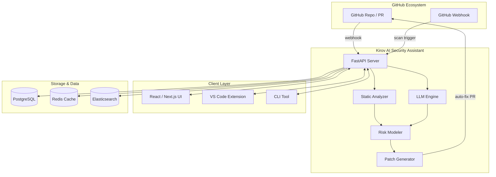

  _   __      _                  ____  _                   _     _           _   _
 | | / /     (_)                / ___|| |                 | |   (_)         | | (_)
 | |/ _ __ ___ _  ___  _ __    \___ \| | ___  _   _ _ __ | |__  _  ___  ___| |_ _  ___
 | | '_ \` _ \| |/ _ \| '_ \    ___) | |/ _ \| | | | '_ \| '_ \| |/ _ \/ __| __| |/ __|
 | | | | | | | | (_) | | | |  |____/| | (_) | |_| | | | | |_) | | (_) \__ \ |_| | (__
 |_|_| |_| |_|_|\___/|_| |_|       |_|\___/ \__,_|_| |_|_.__/|_|\___/|___/\__|_|\___|


```

<p align="center">
  
  
  
  
  
  
  
</p>

<p align="center">
  <b>AI-Powered Code Security Scanning Assistant</b><br/>
  Analyzes GitHub repositories and pull requests for vulnerabilities, explains risks in plain language, and suggests AI-driven fixes.
</p>

---

## 📋 Description

**Kirov AI Security Assistant** is an intelligent code security scanning companion that integrates directly with GitHub to provide real-time vulnerability analysis. It leverages large language models and static analysis to detect security flaws across 15+ programming languages, offering contextual explanations and auto-generated patches.

The assistant scans every commit and pull request, reporting issues directly on the PR with severity ratings, CVSS scoring, and remediation guidance. Built for DevSecOps workflows, it bridges the gap between security teams and developers by making vulnerability reports actionable and understandable.

---

## 🏗️ Architecture



---

## ✨ Key Features

- **🔍 AI-Powered Static Analysis** — Scans code for OWASP Top 10, SANS 25, and CWE categories using custom ML models
- **🤖 PR Integration** — Automated comments on pull requests with vulnerability details and severity badges
- **🛠️ Auto-Generated Fixes** — Suggests code patches using LLM-based code generation with language-specific context
- **📊 Risk Scoring** — CVSS 3.1 scoring with contextual risk assessment tailored to your deployment environment
- **🔐 15+ Language Support** — Python, JavaScript, TypeScript, Go, Rust, Java, C#, C/C++, Ruby, PHP, Swift, Kotlin, Solidity, Terraform, YAML
- **📈 Trending Analysis** — Tracks vulnerability trends across your repositories over time
- **⚡ Real-time Scanning** — Webhook-triggered scans on every push, PR, and merge
- **🔄 CI/CD Integration** — Native GitHub Actions, GitLab CI, Jenkins, and CircleCI plugins
- **📋 SBOM Generation** — Automatic Software Bill of Materials for every scanned repository
- **🎯 Custom Rules Engine** — Define organization-specific security policies and compliance rules

---

## 🛠️ Tech Stack

| Category | Technology |
|----------|-----------|
| **Backend Framework** | FastAPI 0.110+ (Python 3.11+) |
| **Frontend** | Next.js 14 (React, TypeScript, TailwindCSS) |
| **AI/ML** | OpenAI GPT-4 / Anthropic Claude / Local LLMs via Ollama |
| **Static Analysis** | Semgrep, Bandit, ESLint security, GoSec, SpotBugs |
| **Database** | PostgreSQL 16 + Redis 7 |
| **Search** | Elasticsearch 8 |
| **Message Queue** | RabbitMQ / Celery |
| **Containerization** | Docker, Docker Compose, Kubernetes |
| **CI/CD** | GitHub Actions, ArgoCD |
| **Monitoring** | Prometheus, Grafana, Sentry |
| **Auth** | OAuth 2.0 (GitHub App), API keys |

---

## 🚀 Quick Start

### Prerequisites

- Python 3.11+ and Node.js 18+
- Docker and Docker Compose
- GitHub App credentials (for PR integration)
- OpenAI API key (or alternative LLM provider)

### Installation

```bash
# Clone the repository
git clone https://github.com/Raphasha27/kirov-ai-security-assistant.git
cd kirov-ai-security-assistant

# Copy environment configuration
cp .env.example .env
# Edit .env with your API keys and GitHub App credentials

# Start with Docker Compose
docker compose up -d

# Or for local development:
# Backend
cd server
python -m venv venv
source venv/bin/activate  # Windows: venv\Scripts\activate
pip install -r requirements.txt
uvicorn app.main:app --reload --port 8000

# Frontend
cd ../client
npm install
npm run dev
```

### Configure GitHub App

1. Create a GitHub App in your organization settings
2. Set webhook URL to `https://your-domain.com/api/v1/webhooks/github`
3. Grant permissions for: Pull requests (read/write), Checks (write), Contents (read)
4. Install the app on your repositories
5. Add the App ID and private key to `.env`

### Verify Installation

```bash
# Health check
curl http://localhost:8000/api/v1/health

# Scan a public repository
curl -X POST http://localhost:8000/api/v1/scan \
  -H "Content-Type: application/json" \
  -d '{"repo": "Raphasha27/kirov-ai-security-assistant", "branch": "main"}'
```

---

## 📡 API Overview

| Endpoint | Method | Description |
|----------|--------|-------------|
| `/api/v1/health` | GET | Service health check |
| `/api/v1/scan` | POST | Trigger a new security scan |
| `/api/v1/scan/{scan_id}` | GET | Get scan results |
| `/api/v1/vulnerabilities` | GET | List all vulnerabilities |
| `/api/v1/vulnerabilities/{id}` | GET | Vulnerability details |
| `/api/v1/vulnerabilities/{id}/fix` | GET | Get AI-suggested fix |
| `/api/v1/repositories` | GET | List monitored repos |
| `/api/v1/stats` | GET | Dashboard statistics |
| `/api/v1/webhooks/github` | POST | GitHub webhook receiver |
| `/api/v1/sbom/{repo_id}` | GET | Generate SBOM |

Full API documentation is available at `http://localhost:8000/docs` (Swagger UI) after starting the server.

---

## 🔗 Integration with Kirov Ecosystem

The AI Security Assistant is a core component of the Kirov Security Platform:

| Component | Integration |
|-----------|-------------|
| **[Kirov Security Dashboard](https://github.com/Raphasha27/kirov-security-dashboard)** | Feeds vulnerability data for unified SOC visualization |
| **[Kirov Cyber Automation Engine](https://github.com/Raphasha27/kirov-cyber-automation-engine)** | Triggers automated remediation playbooks on critical findings |
| **[Kirov Threat Hunter](https://github.com/Raphasha27/kirov-threat-hunter)** | Correlates code vulnerabilities with known threat actor TTPs |
| **[Kirov DevSecOps Suite](https://github.com/Raphasha27/kirov-devsecops-suite)** | Extends security gates to CI/CD pipelines |
| **[Kirov Security Core](https://github.com/Raphasha27/kirov-security-core)** | Shared security models, RBAC, and audit logging |

---

## 🔒 Security Considerations

- **API Authentication**: All endpoints require either OAuth 2.0 tokens or API keys. Never expose the API without authentication.
- **Secrets Management**: Use a vault solution (HashiCorp Vault, AWS Secrets Manager) for API keys and GitHub App credentials.
- **Webhook Verification**: Validate GitHub webhook signatures using the `x-hub-signature-256` header.
- **Scan Isolation**: Each scan runs in an isolated container to prevent cross-repository data leakage.
- **Rate Limiting**: Configure rate limiting on scan endpoints to prevent abuse.
- **Data Retention**: Scan results are retained per your compliance requirements; configure automated cleanup in `.env`.
- **LLM Privacy**: When using cloud LLM providers, sensitive code may be sent to external APIs. Consider self-hosting models via Ollama for air-gapped deployments.

---

## 🗺️ Roadmap

- [ ] **Q3 2026** — Infrastructure-as-Code scanning (Terraform, CloudFormation, Pulumi)
- [ ] **Q3 2026** — Real-time collaboration for multi-team vulnerability triage
- [ ] **Q4 2026** — Secrets detection with entropy analysis and context-aware risk scoring
- [ ] **Q4 2026** — Container image scanning (Docker, containerd integration)
- [ ] **Q1 2027** — Supply chain attack detection (dependency confusion, typo-squatting)
- [ ] **Q1 2027** — Custom ML model training on organization-specific vulnerability patterns
- [ ] **Q2 2027** — Open-source community plugin marketplace for custom analyzers

---

## 📄 License

This project is licensed under the **MIT License** — see the [LICENSE](LICENSE) file for details.

## 🙏 Attribution

Created and maintained by **Kirov Security Labs** — the research and development division of Kirov, dedicated to advancing AI-driven cybersecurity solutions.

<br/>

---

<p align="center">
  <sub>🔒 <a href="https://github.com/Raphasha27">Raphasha27</a> Security Ecosystem — <a href="https://github.com/Raphasha27/Raphasha27">Back to Profile</a></sub>
</p>

<p align="center">
  <sub>Built with ❤️ by security engineers, for security engineers.</sub>
</p>
